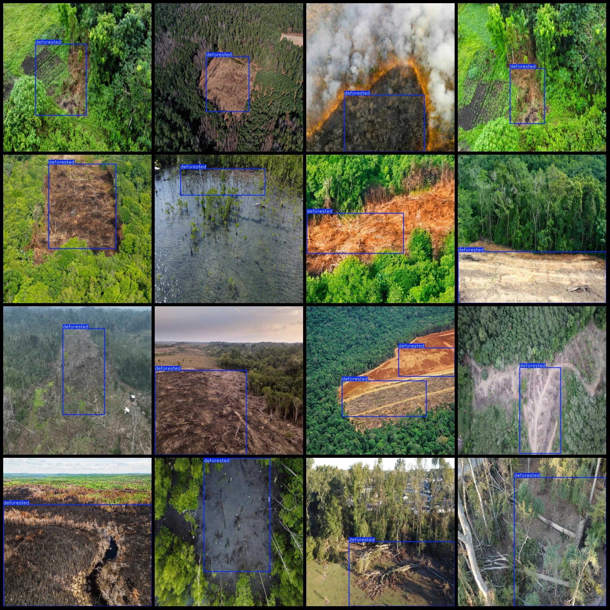
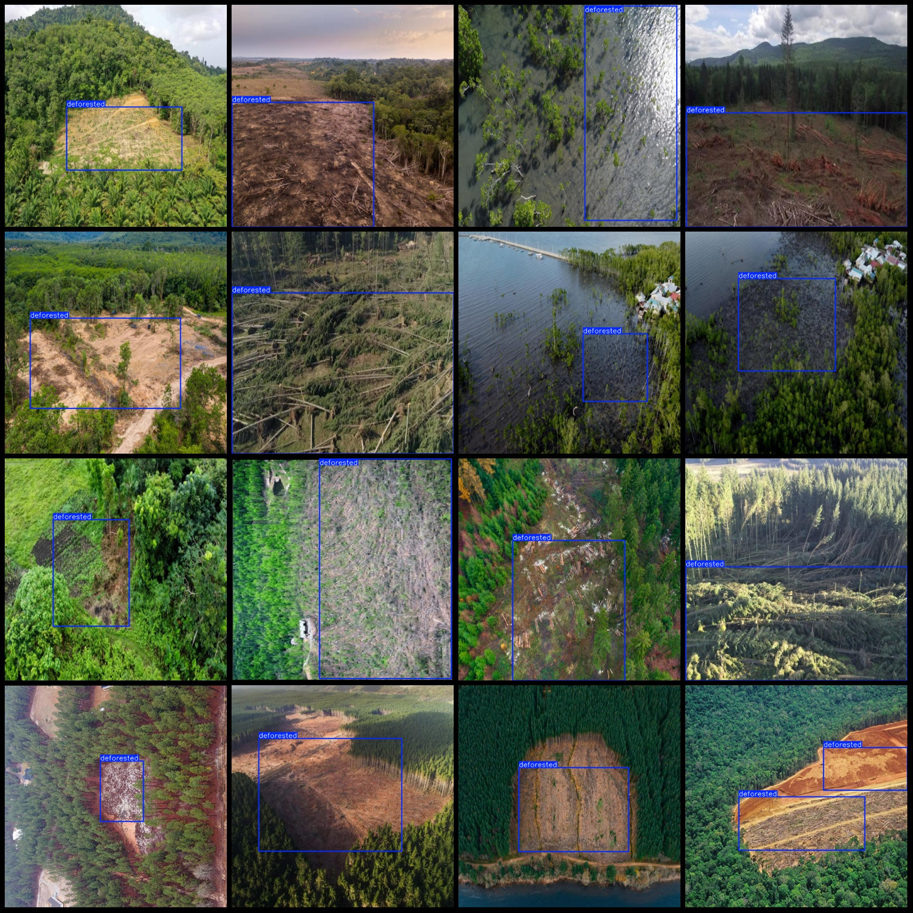

# Drone-View Forestry and Deforestation Patrol Dataset - VOC+YOLO Format with 130 Images and 1 Category

Dataset Format: Pascal VOC format + YOLO format (without split path txt files, only containing jpg images as well as corresponding VOC format xml files and YOLO format txt files)
Number of Images (JPG file count): 130
Number of Annotations (XML file count): 130
Number of Annotations (TXT file count): 130
Number of Annotation Categories: 1
Annotation Category Name: ["deforested"]
Number of Boxes per Category:
deforested boxes = 133
Total Boxes: 133
Number of Images per Category:
deforested images = 130
Image Resolution: 640x640
Annotation Tool Used: labelImg
Annotation Rules: Draw a box around the category
Drone: DJI MAVIC 2
Sampling Height: 40~120m
Sampling Angle: 0~90°
Special Note: The dataset does not include a division of training, validation, and testing sets; please divide them yourself.
Special Remark: This dataset does not guarantee the accuracy of the trained models or weight files.
Preview of Images:
Annotation Example:

## Picture

Here is a pay link on Stripe ( https://buy.stripe.com/3cs8yP7sY87d0vu9AB ). Please contact me lonlonago@foxmail.com after funding $89, and I will send you a complete data files , thank you!

